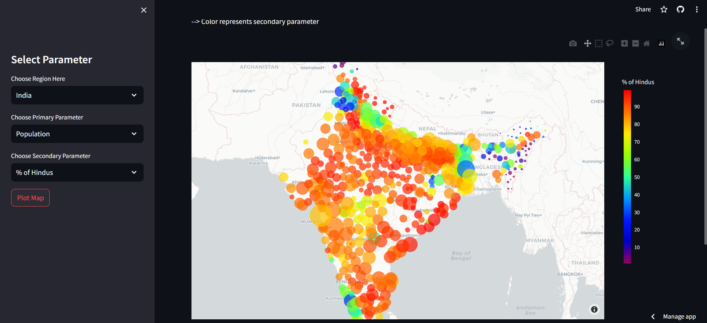

# India Census Dashboard WebApp

## Overview

Welcome to the India Census Dashboard WebApp! This interactive dashboard allows users to explore and visualize data from the Indian Census. It's built using Streamlit to provide a seamless and user-friendly experience.

## Features

- **Interactive Data Visualization:** Explore various aspects of Indian Census data through dynamic and customizable visualizations.
- **Filter and Customize:** Use intuitive controls to filter data based on different parameters and customize visualizations on the fly.
- **User-Friendly Interface:** The dashboard is designed for ease of use, making it accessible to users with varying levels of data literacy.

## Technologies Used

- **Streamlit:** Powering the interactive and responsive web interface.
- **Data Visualization Libraries:** Utilizing popular libraries like Plotly or Matplotlib for creating engaging visualizations.
- **Indian Census Data:** Leveraging official census data for accurate and up-to-date information.

## Getting Started

### Prerequisites

- Python
- Streamlit
- Install required packages using `pip install -r requirements.txt`

### Running the Dashboard

1. Clone the repository: `git clone https://github.com/ish-g/Streamlit_Plotly-India_Cencus_Dashboard/tree/master`
2. Navigate to the project directory: `cd your-repo`
3. Run the app: `streamlit run app.py`

## Explore the Dashboard

1. Open the web app in your browser.
2. Use the interactive controls to filter data based on demographics, regions, or specific parameters.
3. Visualize trends, compare data, and gain insights into Indian Census statistics.

## Contributing

If you'd like to contribute, please fork the repository and create a pull request. Feel free to open issues for bug reports, feature requests, or general feedback.

## Showcase

Include a few screenshots or GIFs showcasing the different features and visualizations available in your dashboard.

## License

This project is licensed under the [MIT License](LICENSE).

## Acknowledgments

- Special thanks to the creators of [Streamlit](https://streamlit.io/) for making the development of interactive web apps a breeze!
